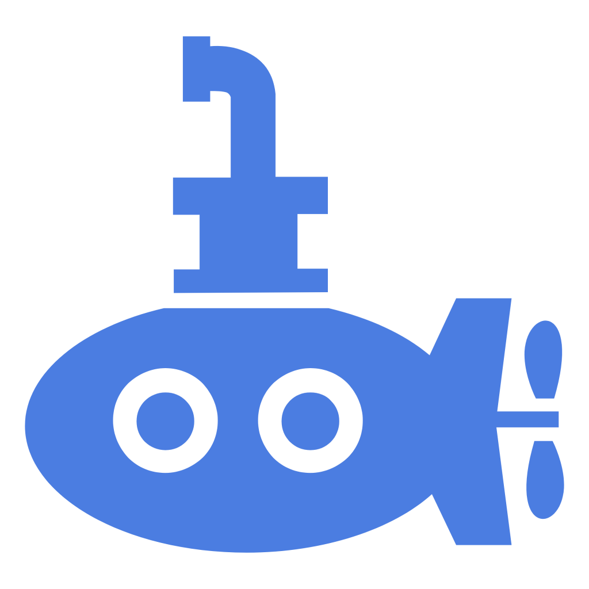
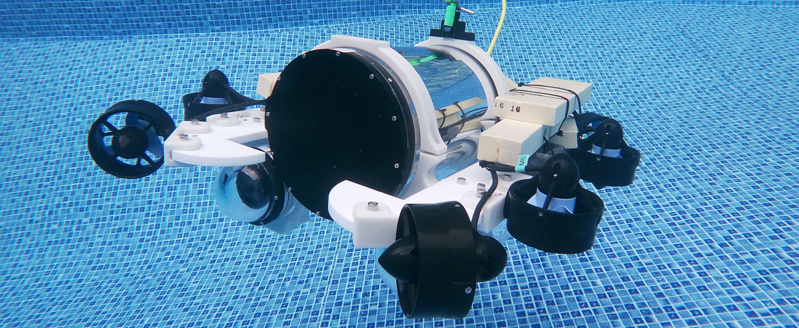
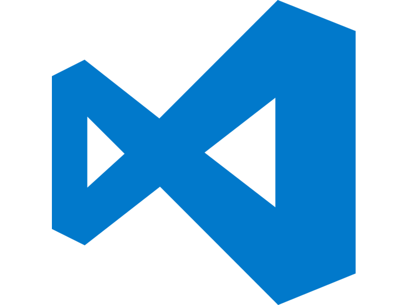

# ASUQTR ROS 2 Workspace

<p align="center">
  
</p>

Welcome to the core ROS 2 workspace for the ASUQTR submarine. This repository contains the full ASUQTR software stack (hardware drivers, LQR control, autonomous behaviors) along with Docker environments for both **desktop development** and **Jetson Xavier deployment**.

---

## Layered Software Architecture

ASUQTR's ROS 2 software follows a typical layered architecture with 5 packages:

> [!TIP]
> Click the package links to access their individual README and specifications.

* [`sub_hardware`](workspace/packages/sub_hardware/)
* [`sub_control`](workspace/packages/sub_control/)
* [`sub_autonomy`](workspace/packages/sub_autonomy/)
* [`sub_interfaces`](workspace/packages/sub_interfaces/)
* [`sub_launch`](workspace/packages/sub_launch/)

<a target="_blank">
  
</a>

In this diagram, **BLACK** icons are ASUQTR nodes/custom code, **WHITE** icons are standard ROS 2 packages.

---

## Repository Structure

```
ros2_workspace/
├── workspace/
│   ├── packages/          ← ROS 2 source packages (mounted as /workspace in Docker)
│   │   ├── sub_hardware/
│   │   ├── sub_control/
│   │   ├── sub_autonomy/
│   │   ├── sub_interfaces/
│   │   └── sub_launch/
│   └── build.sh           ← Build script (run inside the container)
├── env/
│   ├── desktop/           ← Docker environment for development on any machine
│   │   ├── Dockerfile
│   │   ├── setup.sh       ← Builds the Docker image (run once)
│   │   └── start.sh       ← Starts the container
│   └── jetson/            ← Docker environment for the physical submarine
│       ├── Dockerfile
│       ├── setup.sh       ← Full Jetson setup (run once on fresh flash)
│       ├── start.sh       ← Starts the container
│       └── docker-compose.yaml
├── start-desktop.sh       ← Entry point for desktop development
└── start-jetson.sh        ← Entry point for Jetson deployment
```

---

## Environments Overview

| | Desktop | Jetson Xavier |
|---|---|---|
| **Purpose** | Active development | Physical submarine |
| **Platform** | Any x86_64 Ubuntu 22.04 / macOS / WSL2 | NVIDIA Jetson Xavier (JetPack 5.1.6) |
| **Docker image** | `ros2-humble` | `ros2-jetson` |
| **Entry point** | `./start-desktop.sh` | `./start-jetson.sh` |
| **Container name** | `ros2-desktop` | `ros2-desktop` |
| **Workspace mount** | `$(pwd)/workspace:/workspace` | `$(pwd)/workspace:/workspace` |

---

## <a id="ssh"></a>🔌 0. Connect to the Jetson Xavier (SSH)

> [!NOTE]
> Skip this section if you are working in desktop mode.

Before running any scripts on the physical submarine, log into the Jetson Xavier from your laptop:

### MobaXterm (Windows)
<a href="https://mobaxterm.mobatek.net/download.html" target="_blank">
  
</a>

1. Open MobaXterm → **Session** → **SSH**
2. Enter the Jetson's IP address (`192.168.x.x`)
3. Username: `asuqtr`, password: `asuqtr123`

### VS Code (Recommended)
<a href="https://code.visualstudio.com/download" target="_blank">
  
</a>

1. Install the `Remote - SSH` and `Docker` extensions
2. Connect via `Remote - SSH` → `ssh asuqtr@<JETSON_IP>` (password: `asuqtr123`)
3. Once the container is running, open the `Docker` tab → find `ros2-desktop` → right-click → **Attach Visual Studio Code** → open `/workspace`

---

## ⚙️ 1. Setup

### 💻 Desktop (Development)

Use this to develop and test code on your own machine — no submarine required.

1. Clone the repository:
    ```bash
    git clone <repo_url>
    cd ros2_workspace
    ```

2. Start the container (builds the Docker image automatically on first run):
    ```bash
    ./start-desktop.sh
    ```
    > The script checks for the `ros2-humble` image and runs `env/desktop/setup.sh` if it is missing.
    > It also detects whether the IMU (`/dev/ttyUSB0`) is connected and passes it through if available.

You are now inside the `ros2-desktop` container with `/workspace` mounted.

---

### 🤖 Jetson Xavier (Physical Submarine)

> [!WARNING]
> Only run `setup.sh` on a freshly flashed Jetson Xavier via NVIDIA SDK Manager with **JetPack 5.1.6**. Skip this if the Jetson is already configured for ASUQTR.
>
> <a href="https://developer.nvidia.com/sdk-manager" target="_blank">
>   
> </a>

1. SSH into the Jetson Xavier. [See instructions above](#ssh)

2. Clone the repository in the home directory:
    ```bash
    cd ~
    git clone <repo_url>
    cd ros2_workspace
    ```

3. Run the Jetson setup script **(first time only)**:
    ```bash
    sudo bash env/jetson/setup.sh
    ```
    This sets up the SSD, Docker, Jetson I/O permissions, and deploys the ASUQTR infrastructure.

4. Reboot the Jetson:
    ```bash
    sudo reboot
    ```

5. After reboot, start the container:
    ```bash
    ./start-jetson.sh
    ```

You are now inside the container with `/workspace` mounted. The container restarts automatically on power-up after initial setup.

---

## 🛠️ 2. Build the ROS 2 Workspace

Once inside the container (either desktop or Jetson), build the workspace:

```bash
cd /workspace
bash build.sh
source install/setup.bash
```

> [!TIP]
> **Why `--symlink-install`?**
> The build script uses `colcon build` which creates symlinks back to your source files. This means you can edit Python scripts and YAML configs (LQR params, EKF profiles, launch files) and rerun immediately — **no rebuild needed**. Only C++ changes (e.g. the VectorNav IMU driver) require a rebuild.

---

## 🚀 3. Run & Test the Submarine

Open 3 terminals inside the container (or split your VS Code terminal with `Ctrl+Shift+5`).

### Terminal 1 — Launch the submarine

```bash
ros2 launch sub_launch sub.launch.yaml
```

This brings up the full system: control nodes, TF2 tree, EKF (`robot_localization`), hardware drivers, and rosbridge.

**To use a specific EKF sensor profile**, pass the config file as an argument:

```bash
# IMU + DVL only (no depth sensor)
ros2 launch sub_launch sub.launch.yaml ekf_config_file:=$(ros2 pkg prefix sub_control)/share/sub_control/config/robot_localization_imu_dvl.yaml

# IMU only
ros2 launch sub_launch sub.launch.yaml ekf_config_file:=$(ros2 pkg prefix sub_control)/share/sub_control/config/robot_localization_imu_only.yaml

# Jean's tuning
ros2 launch sub_launch sub.launch.yaml ekf_config_file:=$(ros2 pkg prefix sub_control)/share/sub_control/config/Jean_tuned.yaml
```

### Terminal 2 — Monitor the EKF state estimator

```bash
# Estimated position (world frame)
ros2 topic echo /odometry/filtered --field pose.pose.position

# Linear velocities (body frame)
ros2 topic echo /odometry/filtered --field twist.twist.linear
```

### Terminal 3 — Send a target command

> [!NOTE]
> Position is in meters. Orientation uses Roll, Pitch, Yaw **in degrees** mapped to `x, y, z`.

```bash
ros2 topic pub -1 /debug/target_pose geometry_msgs/msg/PoseStamped \
  "{pose: {position: {x: 0.0, y: 0.0, z: 0.0}, orientation: {x: 0.0, y: 0.0, z: 0.0}}}"
```

> [!IMPORTANT]
> `/debug/target_pose` is only available when `control_node` is in `lqr_tuning` mode. See [`workspace/packages/sub_control/config/params.yaml`](workspace/packages/sub_control/config/params.yaml).

---

## 🌐 Web Dashboard

The `docker-compose` setup on the Jetson maps the ASUQTR dashboard to port `80`. Open a browser on any machine on the same network:

```
http://<JETSON_IP>
```
